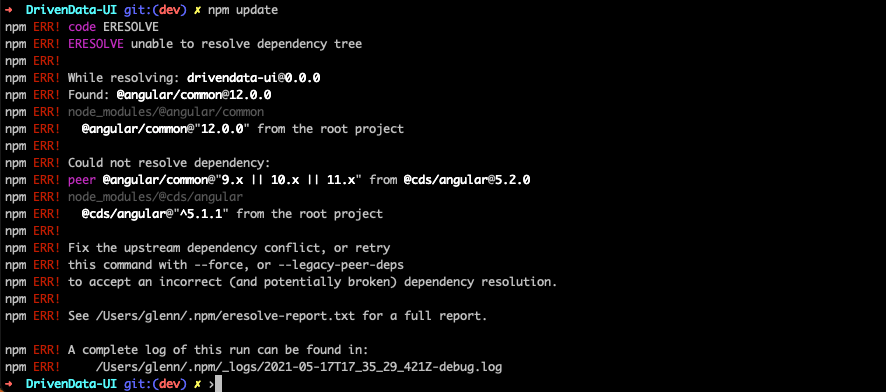

# Troubleshooting

## Description

This document serves as a reference to any issues that have been encountered with updating, building and developing the Angular UI project

 

 

## Peer Dependency Errors

When updating to a new version of Angular, NPM may report errors caused by the inability to resolve certain dependencies. It looks something like this...

### Example

This error is caused by dependencies between NPM packages not matching directly in the dependency tree and is a common problem.

- [Article 1](https://stackoverflow.com/questions/66989383/could-not-resolve-dependency-npm-err-peer-angular-compiler11-2-8)
- [Article 2](http://blog.wafrat.com/fixing-2/)

To resolve this error, run `npm install --legacy-peer-deps` OR `npm install --force`

- the `--legacy-peer-deps` flag adds a configuration to the `package-lock.json` file and prevents this error from resurfacing in the future
- the `--force` flag skips adding this configuration and installs all dependencies while ignoring the error
